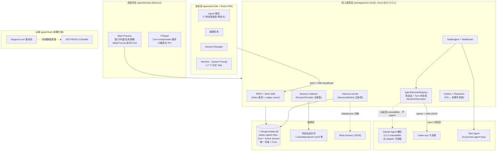
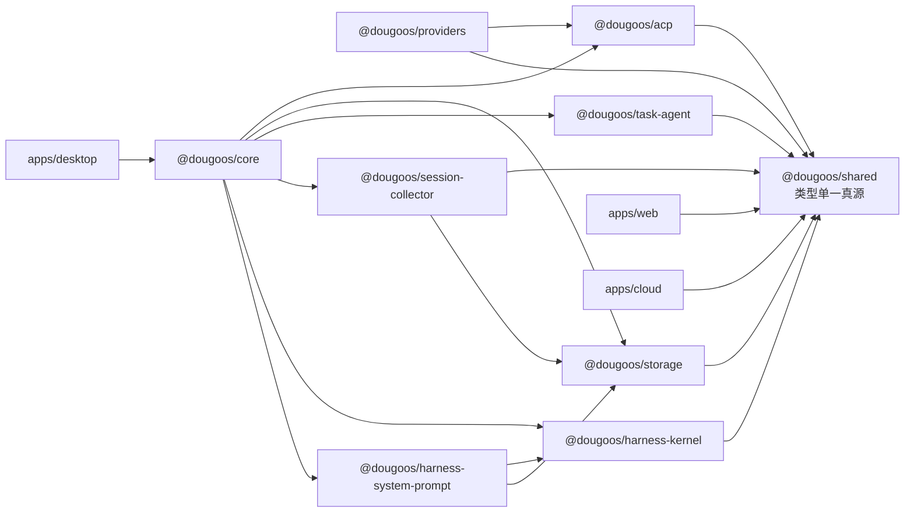
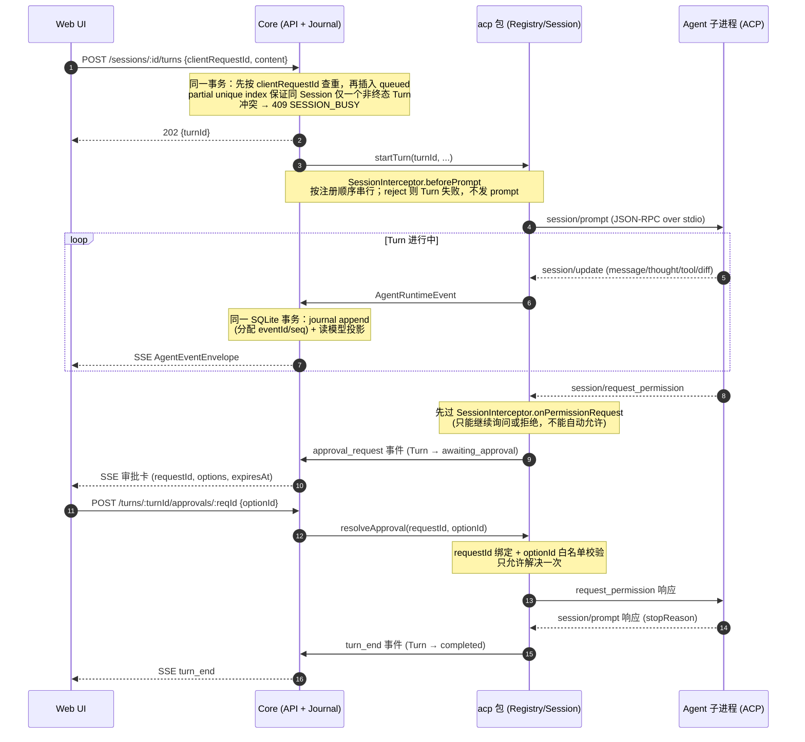
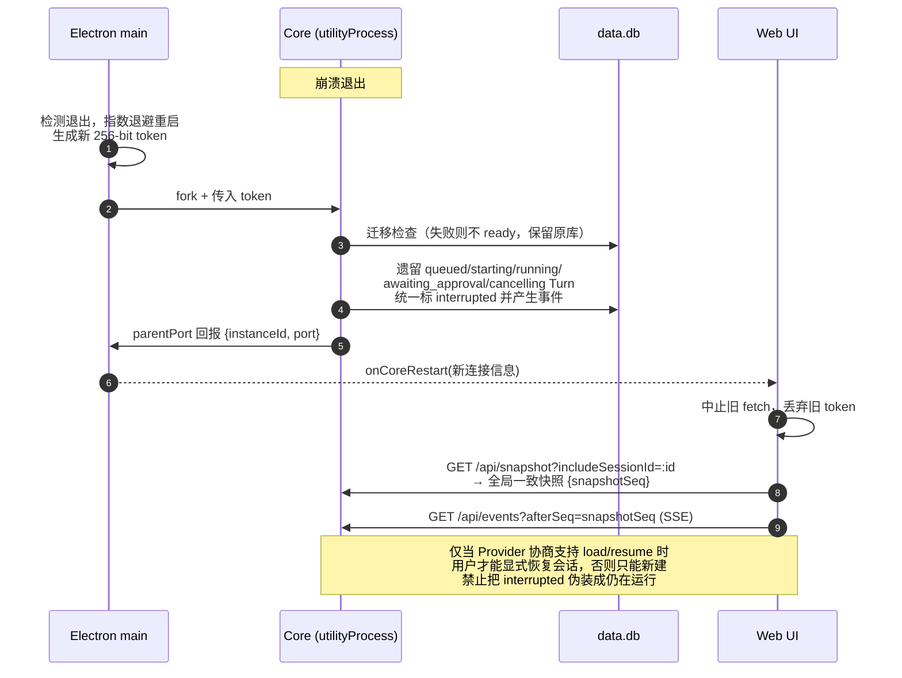
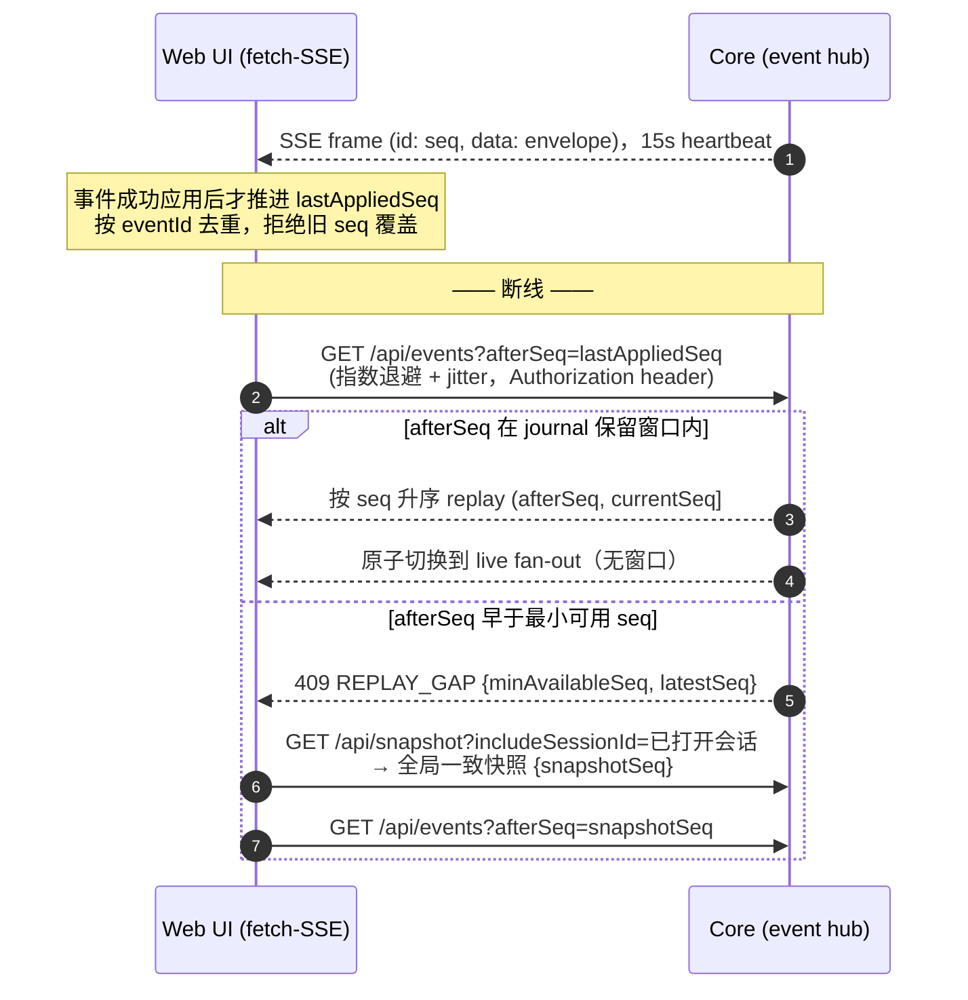

# DougoOS 架构设计方案

## Context

DougoOS 是"多个 Agent CLI，一个控制台"的桌面 AgentOS（原型显示名 AgentOS，官网 dougoos.com）：桌面端承载 Agent 聊天、任务派发、Harness、Session 管理；当前云端仅有落地页与 health 桩，统计上报和备份均后置。本方案基于对 4 份原型/参考项目的完整分析：

- **主原型**（AgentOS SaaS.dc.html）：6 个 Agent（Codex/Claude Agent/Grok/Cursor/Pi/Hermes）、7 种消息类型（user/text/note/think/tool/diff/approval）、Harness 8 子模块、Sessions Manager 7 子模块
- **grok-html-demo**：5 种 CLI 全部经 ACP (JSON-RPC 2.0 over stdio) 统一接入，`AgentProvider` 抽象 + 事件归一化 + 审批闭环已验证；短板是单 activeTurn 全局锁和轮询判静默
- **pi**：agent loop 三层抽象（agentLoop → Agent → AgentHarness）、typebox 工具定义、append-only 会话树——"新建任务 Agent"的设计蓝本
- **code-insights**：CLI 引擎 + Hono server + React dashboard + Electron 薄壳四层；SessionProvider 采集、StatsDataSource 分层、outbox+redaction 上报——Session Manager 的设计蓝本

**已确认约束**：团队 TS/前端为主；云端形态先不定（只打桩留接口）；无账号体系；仅使用可重置的伪匿名 device_id；ACP 锁定稳定 v1，v2 草案不进入主链路。

## 假设清单（原型歧义的处理决定）

1. 产品代号 DougoOS、UI 显示名 AgentOS，架构层面视为同一产品
2. Provider 架构支持按注册表扩展；DougoOS 0.2.0 的 Claude Agent 槽位固定
   fail-closed，不包含或启动 adapter，不能作为可执行 Provider
3. 智能路由原型是前端正则 mock → 设计成 TaskRouter 策略接口，规则版先行、LLM 版后置
4. Hermes 的技能/看板/MCPs 特殊 tab、Memory 图谱、Compare、定时/长程任务：本期不实现，信息架构上占位
5. 审批体系三处（approval 消息 / PreToolUse hook / Agent 原生权限档）统一由 Provider profile 与 ACP 审批闭环承载；可控 Provider 的新 Session 默认最高权限，同时保留可阻断的 `SessionInterceptor`，具体边界见 ADR-0004
6. 提示词"模块切分+字符统计"自动解析器后置；本期 System Prompt 数据用从原型提取的 mock fixtures
7. 本期不提供遥测或同步设置，只允许用户重置本地 device_id，并将其明确称为可重置的伪匿名标识；未来遥测必须经独立产品与隐私设计

---

## 1. 整体架构图

### 1.1 分层图



### 1.2 包依赖图



依赖铁律：依赖图必须保持有向无环，最终收敛到 shared；`acp` 定义协议客户端与 Provider 端口，`providers` 实现这些端口，禁止 `acp` 反向依赖具体 Provider。`web` 只依赖 shared 的协议类型，与 core 仅通过 HTTP/fetch-SSE 通信——这是壳可替换（Electron→Tauri）、UI 可独立调试的根基。

### 1.3 关键流程时序

以下三条是实现期最容易出错的路径，时序图与 §2.3/§2.8、ADR-0001/0002/0003 的文字描述互为约束；不一致时先修文档再改代码。

**(a) Turn 生命周期（含审批闭环）** —— 对应 ADR-0001 状态机与 ADR-0003 拦截语义：



**(b) Core 崩溃恢复与重启握手** —— 对应 ADR-0002 §3 与 §3.6 生命周期：



**(c) SSE 断线重连与 REPLAY_GAP** —— 对应 ADR-0002 §2 replay 协议：



---

## 2. 模块划分

### 2.1 `@dougoos/shared` — 类型单一真源
跨模块类型：归一化事件 envelope、REST/SSE DTO、云协议 v1、DB 实体。零运行时依赖（仅 zod）。参考 code-insights 的 `cli/src/types.ts` 模式。

事件是运行时和恢复协议，不能只表达 UI 展示。acp 包先产生进程内 `AgentRuntimeEvent`；所有跨模块 fan-out、SSE 和恢复使用的 `AgentEventEnvelope` 必须带稳定身份、所属 Turn、全局单调序号和发生时间：

```ts
export interface AgentEventEnvelope {
  v: 1;
  eventId: string;          // 全局唯一，供幂等去重
  seq: number;              // Core 分配的全局单调序号，供 replay cursor
  sessionId: string;        // DougoOS 内部 Session ID
  turnId: string | null;    // 非 Turn 事件（如 session_state）可为 null
  occurredAt: string;       // ISO 8601
  event: AgentUiEvent;
}

/** ACP 包到 Core 组合根的进程内事件；Core 入 journal 后升级为 AgentEventEnvelope。 */
export interface AgentRuntimeEvent {
  sessionId: string;
  turnId: string | null;
  occurredAt: string;
  event: AgentUiEvent;
}

export type AgentUiEvent =
  | { type: "user_message"; messageId: string; body: string }
  | { type: "message_delta"; messageId: string; text: string }
  | { type: "thought_delta"; messageId: string; text: string }
  | { type: "note"; messageId: string; level: "info"|"success"|"warn"; text: string }
  | { type: "tool_call"; toolCallId: string; title: string;
      kind: ToolKind; status: "pending"|"running"; displayInput?: string }
  | { type: "tool_update"; toolCallId: string;
      status: "running"|"done"|"error"|"cancelled"; result?: ToolResult }
  | { type: "diff"; messageId: string;
      diff: { type:"inline"; path:string; oldText:string|null; newText:string }
          | { type:"artifact"; path:string; artifact:ArtifactRef } }
  | { type: "approval_request"; requestId: string; title: string; description?: string;
      options: { optionId: string; label: string; kind: "allow"|"reject" }[];
      expiresAt: string }
  | { type: "approval_resolved"; requestId: string;
      status: "allowed"|"rejected"|"expired"|"cancelled";
      decision: ApprovalDecision|null }
  | { type: "turn_state"; from: ActiveTurnStatus|null; status: ActiveTurnStatus }
  | { type: "turn_end"; from: ActiveTurnStatus;
      status: TerminalTurnStatus; stopReason: StopReason;
      error?: StructuredError; usage?: TokenUsage }
  | { type: "session_state"; state: SessionState }
  | { type: "session_error"; error: StructuredError };
```

`user_message` 在幂等创建 Turn 的事务内写入。`turn_state` 只表示 queued 创建和合法的
非终态转换；`turn_end` 是 completed/failed/cancelled/interrupted 的唯一终态转换，
同时携带 stopReason、error 和 usage。启动恢复直接写一条 `from=<遗留非终态>` 的
interrupted `turn_end`，不能为同一终态再追加第二条状态事件。Projector 必须按
`from → status` 校验并以这一条事件完成终态投影。
所有协议时间戳（包括 `expiresAt`）统一使用 ISO 8601 字符串，避免秒/毫秒歧义并与
数据库时间字段规范一致。外部审批提交必须使用服务端返回的非空 `optionId`；内部
会话关闭时的无选择取消不复用该 HTTP DTO。

只有跨 journal/SSE 的 envelope 带 `v: 1`；当前 domain read model 和 REST DTO 不重复
携带版本字段。envelope `v` 的演进规则与云协议一致：新增可选字段不升版；修改字段
语义或删除字段必须升版并先出 ADR。升版过渡期 Core 同时产出旧版消费方可解析的形态，
UI/collector 对未知 `v` 显式报错并提示升级，禁止静默忽略。

Provider 私有 `_meta` 和原始 ACP envelope 只进入本地诊断日志，不穿过 UI DTO；跨 HTTP 的扩展字段只能是经 zod 校验、大小受限的 `JsonValue`。工具输出上限 30,000 字符，完整序列化 diff 事件上限 1 MiB UTF-8 字节（包含事件字段、路径与 inline 内容），超限改存本地 artifact 并仅传引用。其他 ID、prompt、数组和 HTTP body 的数值上限由 shared 集中导出的 operational policy 给出；这些值是当前实现选择，不冒充 ADR 规定值，并必须覆盖边界前后测试。

跨边界 `ErrorPayload`/REST error 的 message 必须来自 shared 中以 error code 为键的静态
catalog，动态值只能进入 strict 的机器字段 details；Provider doctor 的动态 reason 和
remediation 使用单独的 bounded/sensitive-signature 文本 schema。禁止把 prompt、消息、
工具内容或 ACP 原文直接作为 error message。

### 2.2 `@dougoos/providers` — Agent 接入注册表（扩展点 a）

`AgentProvider` 端口定义在 `@dougoos/acp`，本包只提供实现和注册表。静态进程策略与 ACP 初始化后协商出的能力分开保存，不能用配置值冒充运行时能力：

```ts
export interface AgentProvider {
  id: string;                       // "claude-code" | "codex" | ...
  displayName: string;
  processPolicy: {
    multiSessionPerProcess: boolean;
    maxSessionsPerProcess: number;
  };
  available(): Promise<{ ok: boolean; reason?: string; version?: string }>;
  resolveCommand(ctx: { env: SanitizedProcessEnv }): {
    command: string; args: string[]; env?: Record<string,string>
  };
  chooseAuthMethod(init: AcpInitializeResult, env: SanitizedProcessEnv): string | null;
  /** 厂商私有 _meta（x.ai / codex）→ 统一事件；返回 null 走默认 ACP 映射 */
  normalizeMeta?(update: AcpSessionUpdate): AgentUiEvent[] | null;
}
```

Core 启动 Agent 时只使用 `spawn/execFile` 参数数组，禁止拼接 shell 字符串；传给子进程的环境变量按 allowlist 构造，敏感变量是否透传由用户设置明确控制。

新增 Agent 步骤（checklist 文档化）：实现 `AgentProvider` → 注册 → （可选）`normalizeMeta`。UI 由 `GET /api/providers` 动态渲染，无需改动。用户自定义 CLI 走设置里的 JSON 配置生成 `GenericAcpProvider`，保存前必须完成命令路径、参数和环境变量诊断。
**单独调试**：`doctor.ts` 脚本逐个探测 `available()`。

### 2.3 `@dougoos/acp` — ACP 客户端核心 + Session Registry

使用官方 `@agentclientprotocol/sdk` 的稳定 v1 入口承载 JSON-RPC、schema 与 stdio transport，本包只包装连接生命周期、Provider 端口、事件归一化、Turn 状态机和多会话 Registry；SDK 在 lockfile 锁定精确版本。ACP v2 仍是草案，不得从 experimental 入口进入生产主链路，未来升级先写 ADR。

P1 基线实现 initialize/authenticate/session·new/prompt/cancel/update/request_permission；所有可选能力以 initialize 协商结果为准，并持久化实际 capability snapshot。客户端只声明已经完整实现并经过测试的 fs/terminal/config capabilities，未实现的能力不得出现在 initialize 请求中。session·load/list/delete/resume/close、config options、usage update、message ID 等能力按 Provider 实际支持逐步启用，未声明即视为不支持。对 grok-html-demo 的三处改造：

| grok-html-demo 现状 | DougoOS 设计 |
|---|---|
| 单 `activeTurn` 全局锁 | `AcpConnection` 持有 `Map<acpSessionId, TurnState>`；Registry 管 N 条连接。默认一会话一子进程（崩溃隔离），`multiSessionPerProcess=true` 的 provider 可复用进程；同一 session 同时只允许一个 running Turn |
| `waitUntilOutputIsQuiet` 轮询判静默 | 以 `session/prompt` 响应 (stopReason) 为准；子进程 exit/stderr 转 `session_error` 兜底 |
| 审批 pending 全局表 | 保留 requestId 绑定 + optionId 白名单校验；pending 挂 TurnState，会话关闭统一 cancel，超时可配置 |

```ts
export interface AgentTurnHandle {
  readonly turnId: string;
  readonly completion: Promise<TurnResult>;
  cancel(): Promise<void>;
}
export interface AgentSessionHandle {
  readonly sessionId: string; readonly providerId: string; readonly cwd: string;
  readonly state: "starting"|"idle"|"running"|"awaiting_approval"|
                  "cancelling"|"crashed"|"closed";
  startTurn(input: { turnId: string; text: string; images?: ImageRef[] }): Promise<AgentTurnHandle>;
  resolveApproval(requestId: string, optionId: string | null): Promise<void>;
  subscribe(cb: (e: AgentRuntimeEvent) => void): () => void;
  dispose(): Promise<void>;
}
export interface AgentSessionRegistry {
  create(opts: { providerId: string; cwd: string }): Promise<AgentSessionHandle>;
  get(sessionId: string): AgentSessionHandle | undefined;
  list(): SessionSummary[];
  disposeAll(): Promise<void>;
}
```

`startTurn` 只负责成功提交 ACP `session/prompt` 并返回 handle，Turn 完成由 `completion` 和事件流表达。Core 必须在调用它之前用 `clientRequestId` 完成幂等建 Turn；同一 session 已有任意非终态 Turn 时由数据库原子约束返回 409，本期不做隐式排队。

可阻断扩展点定义在本包，由 Core 在组合根注入：

```ts
export interface SessionInterceptor {
  beforePrompt?(ctx: PromptContext): Promise<"allow" | "reject">;
  onPermissionRequest?(ctx: PermissionContext): Promise<PermissionVerdict>;
  afterEvent?(event: AgentRuntimeEvent): Promise<void>;
}
```

`beforePrompt` 与 `onPermissionRequest` 按注册顺序、带超时串行执行；`afterEvent` 仅观察、不得阻塞事件主链。P1 注册空链，未来 Harness Hooks 通过该接口接入。ACP Agent 未发起 permission request 时，客户端无法拦截 Agent 内部自行执行的工具，产品必须明确显示该安全能力边界。

Turn 状态机固定为：`queued → starting → running ↔ awaiting_approval`；`running → completed|failed`；`running|awaiting_approval → cancelling → cancelled`；任意非终态在进程恢复时可转 `interrupted`。每次状态变化都先形成 `AgentRuntimeEvent`，由 Core journal 分配 eventId/seq 后再对外发布；acp 包不得自行生成全局 seq。

**单独调试**：包内 headless REPL（`acp repl -- --provider claude-code --cwd ~/proj`），终端跑完整 ACP 对话含审批，不需要 UI/core；也是集成测试载体。

### 2.4 `@dougoos/storage` — 本地存储 + Outbox
better-sqlite3 (WAL) + 版本化迁移（照 code-insights 迁移器）。唯一写者是 core 进程。核心表：

```
devices(device_id, created_at, app_version)
providers_status(provider_id, last_seen_version, ...)
sessions(id, source, provider_id, cwd, title, created_at, updated_at)
        -- + provider_session_id, capability_snapshot_json, last_state
        -- source: 'dougoos-acp' | 'external:claude-code' | ...
turns(id, session_id, client_request_id, status, started_at, ended_at,
      stop_reason, error_json)
session_events(seq, event_id, session_id, turn_id, type, payload_json, occurred_at)
messages(id, session_id, turn_id, source_message_id, role, kind,
         content, tool_meta_json, ts)
approval_requests(id, turn_id, request_id, status, options_json, expires_at, resolved_at)
tasks(id, client_request_id, prompt, routing_json, session_id, turn_id, status, created_at)
prompt_versions(id, agent_id, tag, model, date, sha256, raw_text)
prompt_modules(id, version_id, category, char_count, excerpt)
rule_lineage(id, agent_id, name, category, born_version, died_version, note)
usage_stats(session_id, tokens_in, tokens_out, quality)   -- exact/estimated/mixed/unavailable
outbox(id, kind, payload_json, created_at, attempts, next_attempt_at, sent_at)
sync_state(source_key, file_id, file_size, last_mtime, last_offset, generation)
imported_records(source_key, source_record_id, content_hash, imported_at)
settings(key, value_json)
```

约束：

- `turns(session_id, client_request_id)`、`session_events(event_id)`、`messages(session_id, source_message_id)` 和 `imported_records(source_key, source_record_id)` 建唯一索引，保证 API 重试、ACP replay 与外部日志重复扫描幂等。
- `turns` 增加 partial unique index：`UNIQUE(session_id) WHERE status IN ('queued','starting','running','awaiting_approval','cancelling')`。创建 Turn 必须在一个 SQLite 事务内先按 `(session_id, client_request_id)` 查重，再尝试插入 queued：命中原请求返回原 turnId；触发活跃 Turn 唯一约束则返回 `409 SESSION_BUSY`。禁止用“先查询再在事务外插入”的竞态实现。
- `session_events.seq` 是 Core 分配的全局单调 cursor。每个事件在同一 SQLite 事务中完成 journal append 与 messages/turns/approvals 等读模型投影，提交后才 fan-out 到 SSE；高频文本 delta 在 ACP 归一化层以不超过 50ms 的窗口合并，避免逐 token 写库。journal 默认保留最近 7 天或 100,000 条（先到者为准），清理前保证物化成功。
- Core 启动恢复时，将遗留的全部非终态 `queued/starting/running/awaiting_approval/cancelling` Turn 在同一恢复事务中标成 `interrupted` 并写对应事件；事务提交后 partial unique index 自动释放该 Session 的活跃槽位。只有 Provider 协商支持 load/resume 时才允许用户显式恢复，禁止把崩溃前状态伪装成仍在运行。
- 外部 JSONL 同步用 `file_id + size + mtime + offset + generation` 判断截断、轮转和原地重写，不能只依赖 mtime。
- WAL 同时设置 `busy_timeout`、明确 `synchronous` 级别并定期 checkpoint；大批量采集必须分批事务，避免 better-sqlite3 长时间阻塞 Core 事件循环。

storage 暴露 `EventJournalStore.appendAndProject(runtimeEvent)`：在单事务中生成 eventId/seq、写 journal、更新读模型并返回 envelope。Core 是唯一调用者，提交成功后才发布事件。

**单独调试**：纯 Node 库，vitest 对临时 db 跑；`db-inspect.ts` 打印 schema 版本。

### 2.5 `@dougoos/task-agent` — 新建任务（智能路由 + 任务 Agent）

`ProjectCatalog` 必须包含一个固定 identity 的内置逻辑项目“对话”。它不依赖历史 Session
是否存在，也不以目录 basename 作为 identity。Desktop 在 Core 启动时以
`join(app.getPath("documents"), "Dogoos")` 提供系统默认目录；Home 默认选择该逻辑项目，
但只有 Settings 可以展示和更改其真实绝对路径。修改目录只改变未来新建 Session 的
`cwd`，历史 Session 的 `cwd` 与文件均不迁移。普通目录项目继续使用自身绝对 `cwd`。

```ts
export interface TaskRouter {
  readonly kind: "rules" | "llm";
  route(req: TaskRequest, ctx: RouterContext): Promise<RoutingDecision>;
}
export interface RoutingDecision {
  agentId: string; cwd: string;
  confidence: number;        // <阈值 时 UI 弹确认
  rationale: string;         // 展示"为什么选它"
  rewrittenPrompt?: string;  // LLM 路由可改写
}
```

`task-agent` 不得直接依赖 storage、acp 或 core；它定义最小端口 `TaskRepository`、`SessionLauncher`、`ProjectCatalog`，由 core 注入适配器。P2 实现 `RulesTaskRouter`（关键词/项目匹配，纯函数可单测）；P4 实现 `LlmTaskRouter`（in-process 最小 agent loop + structured output）。`TaskEngine` 只依赖这些接口。

LlmTaskRouter 会把任务文本发送给用户选择的模型提供方，因此必须复用产品的模型/隐私设置并在首次启用时明示；未配置模型、离线或拒绝外发时自动降级到 RulesTaskRouter，禁止静默上传 prompt。
**单独调试**：router 表驱动单测；TaskEngine 用 fake Registry。

### 2.6 `@dougoos/session-collector` — Session Manager 数据面
Session Manager 面向两类来源，但内部实时记录不属于 collector：

- **内部**：Core 把 Registry 的 `AgentRuntimeEvent` 交给 storage 的 `EventJournalStore`，得到 envelope 后发布；collector 只读取这些已物化的 `dougoos-acp` 会话
- **外部**：本包提供 code-insights 式 `SessionProvider{providerName, discover, parse}` 注册表 + `sync_state` 文件身份/大小/mtime/offset 增量；复用 classifyUserMessage（过滤 80% 非真人 user 条目）与 5 级标题 fallback 思路。每条来源记录必须提供稳定 sourceRecordId，无法提供时用规范化内容 hash 兜底

统计侧：`StatsDataSource` 接口 → `LocalStatsDataSource`(SQL) → `aggregation.ts` 纯函数，UI 只吃聚合结果。
**单独调试**：`collect.ts --provider claude-code --dry-run` 打印解析结果不入库。

### 2.7 Harness：`harness-kernel` + `harness-system-prompt`（扩展点 b，详见 3.3）

System Prompt 的数据访问接口（mock/真库无缝切换的落点）：

```ts
export interface PromptDataSource {
  listAgents(): Promise<PromptAgent[]>;
  listVersions(agentId: string): Promise<PromptVersion[]>;
  getModules(versionId: string): Promise<PromptModule[]>;   // 基因组条带数据
  getRuleLineage(agentId: string): Promise<RuleLineageEntry[]>;
}
// MockPromptDataSource(从原型硬编码数据提取的 JSON fixtures)
// SqlitePromptDataSource(读 prompt_* 表)
// 切换：settings.harness.systemPrompt.dataMode
```

Mock fixtures 的 JSON schema 与 SQLite 行结构字段完全一致（同一 zod schema 校验），保证切换无缝。

### 2.8 `@dougoos/core` — 组装层（Hono server，唯一组合根）

```
GET  /api/providers                      Agent 卡片墙
POST /api/sessions                       {providerId, cwd}
GET  /api/sessions/:id                   会话快照 + sessionSnapshotSeq（仅局部基线）
GET  /api/snapshot                       全局一致快照；可重复 includeSessionId
POST /api/sessions/:id/turns             {clientRequestId, content[]} → 202 {turnId}
POST /api/turns/:turnId/cancel           幂等取消 → 202
POST /api/turns/:turnId/approvals/:reqId {optionId}
GET  /api/events?afterSeq=N     (SSE)     全局事件流；可选 sessionId 仅供调试
POST /api/tasks                          {clientRequestId, ...} 新建任务（走 TaskRouter）
GET  /api/stats/*                        Session Manager 聚合
/api/harness/:moduleId/*                 模块子路由
GET  /api/health/live
GET  /api/health/ready
```

`GET /api/snapshot?includeSessionId=a&includeSessionId=b` 在一个 SQLite read transaction 中返回：

```ts
{
  snapshotSeq: number;              // 此快照已包含 [0, snapshotSeq] 的全部已提交事件
  sessions: SessionSummary[];       // 全部会话摘要，覆盖后台会话的漏事件影响
  includedSessions: SessionSnapshot[]; // UI 请求的已打开会话 + Core 自动补入的活跃会话
  activeTurns: TurnSnapshot[];
  pendingApprovals: ApprovalSnapshot[];
}
```

当前 operational policy 最多允许 32 个 active Session、每次显式请求 32 个 inactive
Session，`includedSessions` 容量为两者之和 64。Core 在创建新 active Turn 前必须执行
该上限并返回结构化 `ACTIVE_SESSION_LIMIT_REACHED`，不能产生无法自动完整纳入
GlobalSnapshot 的第 33 个 active Session。approval 历史与全局 pending index 分别
使用独立限额；历史超过限额返回 `SNAPSHOT_LIMIT_EXCEEDED`，禁止静默截断为伪完整
快照。未来分页需先演进 DTO 与 replay 语义。

UI 只建立一条全局事件流，再按 sessionId 分发，避免多会话各占一条浏览器连接。客户端使用 fetch-based SSE 并通过 `Authorization` header 发送 token；禁止原生 `EventSource`，因为它不能设置 bearer header。SSE 每 15s heartbeat，断线指数退避重连并携带 `afterSeq`。若 cursor 已超出 journal 保留窗口，Core 返回 `409 REPLAY_GAP`；UI 必须暂停 reducer，使用所有已打开的 sessionId 获取全局一致 snapshot，以其 `snapshotSeq` 完整替换本地基线，再恢复全局事件流。禁止用单 Session 快照推进全局 seq。注意 409 承载两种语义（`SESSION_BUSY`、`REPLAY_GAP`），客户端必须按结构化错误体的 `code` 字段分流处理，禁止只判断 HTTP 状态码。

正常打开一个尚未加载的 Session 时，UI 可临时缓冲该 Session 的 live 事件，获取 `{sessionSnapshotSeq, ...}`，用快照替换该 Session 的局部状态后只重放缓冲区中 `seq > sessionSnapshotSeq` 的事件；这个局部 cursor 永远不能赋值给全局 `lastAppliedSeq`。

安全与启动握手：

1. Core 只绑定 `127.0.0.1` 的随机端口（listen port 0）。Electron main 每次启动生成 256-bit bearer token，通过 utility process 的父子消息通道传入；Core 成功迁移、监听并完成 Provider registry 初始化后回报 `{instanceId, port}`。
2. Preload 只暴露 `getCoreConnection()` 和 `onCoreRestart()`，token 仅保存在 renderer 内存，不写 localStorage、日志或 URL。Core 崩溃后 main 指数退避重启，生成新 instanceId/port/token，UI 丢弃旧连接并执行 snapshot + replay 重建。
3. 生产 renderer 注册为安全、标准的 `app://dougoos` scheme；Core 校验 `Authorization`、`Origin` 和 `Host`，生产只允许该应用 origin，dev 只允许显式配置的 Vite origin。所有 JSON body 和 prompt 都有大小上限；未来若增加上传或云端 ingest，必须另行定义并验证边界。
4. BrowserWindow 强制 `nodeIntegration:false`、`contextIsolation:true`、`sandbox:true`，配置严格 CSP，禁止任意导航、`window.open`、未知权限和未审查的外部协议。
5. dev 浏览器调试时才写 `.dev-token`，文件必须 gitignore、0600、每次启动轮换；固定端口冲突时失败并给出诊断，不静默连接已有服务。

**单独调试**：`core dev` 起 headless server，curl 即测——core 不感知 Electron。

### 2.9 apps
- **desktop**：薄壳。`utilityProcess.fork` 拉起 core，通过 parentPort 完成 ready/restart 握手；处理静态资源 cwd、asar unpack、better-sqlite3 ABI、macOS arm64/x64 与 Windows 进程树等打包问题。启动命令同时把 `join(app.getPath("documents"), "Dogoos")` 作为系统默认对话目录传给 Core；该值不是 Sidebar/Home 文案。启动时可用登录 shell 读取一次环境快照，但只能用 `execFile(shell, ["-ilc", "env -0"])` 一类固定参数调用，禁止把用户输入插进 shell 命令。preload 只暴露 Core 连接状态、目录选择器和窗口控制。
- **web**：Vite + React 19 + TanStack Query + Recharts；Harness 8 tab 中 7 个渲染"占位卡 + 注册状态"。
- **cloud**：Cloudflare Worker + 同域静态落地页。本期 Worker 只处理 `GET/HEAD /v1/health`，其他 `/v1/*` 稳定返回 `404`；不读取请求体，不接入 Hono、D1、KV、Queue、账号、遥测或业务 payload。`device_id` 仅保存在本地 SQLite，可生成和重置。真实 ingest 与持久化属于 P3+，必须先补协议、隐私评审、限流和保留策略，不能从当前 health 桩推断为已实现。

---

## 3. 关键设计决策

### 3.1 渲染层通信：本地 Hono server (HTTP + fetch-SSE)，不用 Electron IPC 直连

| | IPC 直连 | 本地 Hono server（选定） |
|---|---|---|
| UI 独立调试 | 不能脱离 Electron | Vite dev server + 浏览器直连 |
| core 独立调试 | 与壳耦合 | headless `core dev`，curl 即测 |
| 换壳成本（Tauri） | 通信层全重写 | 壳只负责"起进程 + 传 port/token" |
| 代价 | — | 端口/token 生命周期 + SSE cursor/replay |

code-insights 已验证此路线（server 入口被 CLI 和 Electron 共用）。原生能力（目录选择、托盘、通知）保留极小 IPC 面。SQLite 与 ACP 子进程全部住在 core 进程，渲染层零 Node 权限。

这里的 SSE 是 wire format，不代表使用浏览器原生 EventSource。Web 客户端统一使用可设置 Authorization header、可控制 retry/afterSeq 的 fetch 流式实现。

**桌面框架**：Electron（团队 TS，Node 子进程/native 模块零摩擦）。备选 Tauri 2：体积/内存优，但 ACP 适配器是 npm 包、core 是 Node 程序，Tauri 下仍需 Node sidecar（Rust 壳 + Node 后端双心智）；HTTP 边界保证未来迁移只重写壳层数百行。

### 3.2 "新建任务"Agent：in-process harness，不走 ACP

- 方案 A（任务 Agent 也 ACP 化）：协议统一，但其工具（经注入端口查注册表、写 tasks 表、调 Registry）全是进程内能力，过 stdio 序列化纯属绕路，还要额外做打包/进程管理。
- **方案 B（选定）**：按 pi 三层抽象在 task-agent 包内实现约 300 行最小 agent loop（tool schema 约定、terminate 显式收尾、hook 审批点照抄 pi 设计），LLM 调用用 Vercel AI SDK。不直接 npm 依赖 pi monorepo（它是产品仓不是库），pi 是设计蓝本不是代码依赖。

边界：**可执行 Agent（Codex/…）一律 ACP；编排 Agent（任务路由）一律 in-process**。
Claude Agent 在 0.2.0 中是 fail-closed 例外，只保留状态槽位，不创建 ACP 子进程。且分两步：
P2 纯规则不上 LLM，P4 才引入 LlmTaskRouter。

### 3.3 Harness 扩展机制：编译期注册的 HarnessModule 插件接口

不做动态运行时插件（单机单用户、模块自家写，动态加载过度设计）。接口 + 路由约定 + 编译期注册：

```ts
export interface HarnessModuleContext {
  readonly settings: SettingsPort;
  readonly eventReader: SessionEventReader;
  readonly logger: SafeLogger;
}

export interface HarnessModule {
  id: HarnessModuleId;   // "system-prompt" | "skills" | "mcp" | "subagents"
                         // | "goals" | "workflows" | "hooks" | "rules"
  title: string;
  status: "active" | "planned";              // planned → UI 占位卡
  createApiRouter?(ctx: HarnessModuleContext): Hono; // 挂 /api/harness/{id}/*
}
```

禁止把 `CoreDeps`、数据库连接或 `AgentSessionRegistry` 整体传给模块；模块只能拿按用途裁剪的端口。模块自带迁移作为独立 `migrations` export，由 core 组合根收集到 storage 的全局迁移 manifest；迁移 ID 使用 `<module-id>:<sequence>`，启动时先检测重复 ID，再按 manifest 固定顺序执行。这样 kernel 不依赖 storage，模块也不会反向依赖 core。

三个约定构成扩展位：(1) API 命名空间 `/api/harness/{id}/*`；(2) 前端路由 `/harness/{id}`，侧栏项由 `GET /api/harness/modules` 驱动；(3) 每模块独立包 `packages/harness/<id>`，自带迁移和类型化 DataSource。需要介入会话运行时的模块另行导出 `SessionInterceptor[]`，由 core 注入 Registry；Registry 事件总线只用于观察，不能冒充 PreToolUse 阻断点。

### 3.4 本期本地身份边界与未来数据同步

- 本期只实现本地 `device_id`：首启生成 UUIDv4，永不采集账号信息；它是可关联多次本地记录的伪匿名标识，不宣称真正匿名。设置页支持重置，重置后旧 ID 不可恢复。
- 当前没有 `/v1/ingest`、云协议、outbox 调度器、D1/KV/Queue、业务 payload 或后台网络请求。Landing 上的账号和 Cloud Sync 都是本地 fixture/demo 状态。
- P3+ 若引入 metrics，同一 SQLite 事务 outbox、严格 allowlist schema、redaction、幂等、限流、保留期和 `localOnly` 必须作为一个完整安全设计交付；不能把业务对象直接 spread 成 payload，也不能把 redaction 当作第一道边界。
- 未来加密备份可以评估复用 outbox，但在密钥管理 ADR 与用户授权完成前，禁止发送任何本地内容。

### 3.5 技术选型汇总

| 领域 | 选定 | 理由 | 备选 |
|---|---|---|---|
| 桌面壳 | Electron 当前受支持稳定线（P0 锁定精确 patch） | 全 TS、Node 子进程/native 模块无摩擦；禁止以已 EOL 的 33 作为下限 | Tauri 2（体积优，需 Node sidecar） |
| 前端 | Vite + React 19 + TanStack Query + Recharts | 团队栈；code-insights 同款验证 | Solid/Svelte |
| 本地服务 | Hono | 轻、TS 原生、与云端同框架 | Fastify |
| 本地存储 | better-sqlite3 (WAL) | 同步 API 简单可靠；踩坑经验可复用 | libsql（未来云备份平滑） |
| ACP 客户端 | 官方 `@agentclientprotocol/sdk` 稳定 v1 | 避免自研 JSON-RPC/schema 漂移；本包只包装 Registry | 自研仅限官方 SDK 无法覆盖且有 ADR 的缺口 |
| 通信 | REST + fetch-SSE | 单向事件流够用；支持 bearer header 与 cursor replay | WebSocket（双向流需求出现再换） |
| LLM（路由 Agent） | Vercel AI SDK | 多 provider、structured output | 自研 pi-ai 式抽象 |
| 云端 | Cloudflare Worker + Static Assets；D1/Hono 后置 | 本期仅同域 Landing 与 health；不建立数据面 | Supabase / Vercel |
| Monorepo | pnpm workspace + turborepo | 参考项目验证 | nx |

### 3.6 Agent 进程与 Core 生命周期

- 默认最多并发 4 个 Agent 子进程，可在设置中调整；超过上限进入显式队列，UI 展示 queued，不允许无限 spawn。
- 一会话一进程的 Provider 在 Turn 完成后保持可复用；空闲 30 分钟自动 `session/close`（若支持）并退出。多 Session 进程严格遵守 `maxSessionsPerProcess`。
- 关闭顺序：拒绝新 Turn → cancel running Turn → 解决/取消 pending approval → `session/close` → SIGTERM → 超时后杀完整进程树。应用退出、Core 崩溃、系统 suspend/resume 都走同一状态机。
- 子进程 stdout 只承载 ACP，不混入日志；stderr 进入大小受限、脱敏的本地日志。连续崩溃采用指数退避并在阈值后熔断，用户手动重试才恢复。
- Core 的 liveness 只表示进程存活；readiness 需数据库迁移完成、HTTP 已监听、Provider registry 已加载。Electron 只在 ready 后展示主界面。

### 3.7 可观测性、打包与升级

- Core、desktop、Provider 使用结构化本地日志，字段经过与云上报不同的本地脱敏规则；默认滚动保留 5 × 20 MiB。诊断包必须由用户主动导出，并在生成前列出将包含的文件。
- P0 即建立打包 smoke：应用启动、Core ready、better-sqlite3 加载、创建/关闭一个 fake Agent 会话。公开发布前增加 macOS 签名/公证、Windows 签名、自动更新签名校验和迁移前备份。
- Electron 只跟随官方仍受支持的最近三条稳定线，依赖锁定精确版本；每季度检查升级，禁止长期使用“某旧版本以上”的宽泛基线。
- 数据库迁移失败时 Core 不进入 ready；保留原库和迁移日志，禁止自动删除重建。升级前做 SQLite 在线备份，恢复流程以 ADR 和故障演练验证。

---

## 4. 目录结构

```
dougoos/
├─ pnpm-workspace.yaml
├─ turbo.json
├─ apps/
│  ├─ desktop/                  # Electron 壳（main/preload；无业务逻辑）
│  │  └─ src/{main.ts, preload.ts, core-process.ts}
│  ├─ web/                      # 渲染层 SPA
│  │  └─ src/{routes/, features/{chat,new-task,sessions,harness,settings}, api/client.ts}
│  └─ cloud/                    # Workers + 落地页（本期桩）
│     └─ src/{ingest.ts, landing/}
├─ packages/
│  ├─ shared/                   # 类型单一真源 + zod + 云协议 v1
│  ├─ acp/                      # 官方 SDK 包装 / SessionRegistry / Turn / Interceptor / repl
│  ├─ providers/                # AgentProvider 实现 + registry + doctor
│  ├─ storage/                  # sqlite + migrations/ + event journal + outbox
│  ├─ task-agent/               # TaskRouter(rules/llm) + 最小 agent loop
│  ├─ session-collector/        # SessionProvider registry + recorder + aggregation
│  ├─ harness/
│  │  ├─ kernel/                # HarnessModule 接口 + 占位工厂
│  │  └─ system-prompt/         # 本期唯一 active 模块
│  └─ core/                     # Hono server 组装根（headless CLI 入口）
└─ docs/adr/                    # 关键决策存档为 ADR
```

---

## 5. 迭代路线

| Phase | 内容 | 留桩 |
|---|---|---|
| **P0 骨架**（~1 周） | monorepo + event/turn/shared schema + storage 迁移器/journal + core 空 server + fetch-SSE replay + web 壳 + Electron ready/restart 握手 + device_id | 云端仅 /v1/health |
| **P1 ACP 聊天**（~2-3 周，核心） | 官方 ACP SDK v1 包装（多会话 Registry + Turn 状态机 + 空 Interceptor 链）+ EventJournalStore 实时记录 + providers（Codex 先行；Claude Agent 在 0.2.0 中 fail-closed）+ 聊天 UI 7 种消息 + 审批/取消闭环 + acp repl | 其余 provider 按 checklist 陆续加 |
| **P2 新建任务 + SM 本地**（~2 周） | RulesTaskRouter + TaskEngine + tasks/turns 幂等；外部 claude-code SessionProvider + 轮转/截断处理 + Dashboard 基础统计 | LlmTaskRouter 留接口；Insights/Patterns 占位 |
| **P3 Harness·SystemPrompt + 云端数据面**（未来） | system-prompt 模块（Mock DataSource 起步、表结构就绪）+ 7 个 planned 占位；经独立 ADR/隐私评审后再考虑 metrics schema、outbox、redaction 与 ingest | 当前 MVP 只有 Landing + `/v1/health`；backup 仅留 ADR 入口 |
| **P4+** | LlmTaskRouter、更多 provider、Skills/MCP 等逐个 active、加密备份 | — |

每个 Phase 验收含一条 headless 验证：P0 杀掉 Core 验证 Electron 重启、token 轮换与 SSE snapshot+replay，并验证 Worker 只有 health；P1 用 acp repl 跑一轮带审批和取消的对话；P2 用相同 clientRequestId 重试建任务并模拟 JSONL 截断；未来 P3 数据面只有在独立安全设计获批后才定义其 dry-run 验收。

**明确不做清单**（防过度设计）：运行时插件加载、微服务/消息队列（outbox 表即队列）、账号体系、ACP 化任务 Agent、本期提示词自动解析。

## 6. 已确认 ADR

- [ADR-0001：Turn、事件 Envelope 与本地 Journal](./adr/0001-turn-event-journal.md)
- [ADR-0002：fetch-SSE 鉴权、Replay 与 Core 重启握手](./adr/0002-fetch-sse-auth-replay.md)
- [ADR-0003：SessionInterceptor 与 Harness Hooks 安全边界](./adr/0003-session-interceptor-hooks.md)

## 验证方式

- P0：`pnpm -r build` 通过；Electron 收到 Core ready 后再展示主界面；杀 Core 后新 instanceId/port/token 生效；queued/starting/running/awaiting_approval/cancelling 均恢复为 interrupted；UI 通过全局 snapshot+replay 恢复且无重复事件
- P1：acp repl 对可用 Provider 完成一轮含审批和取消的对话；Claude Agent doctor 固定返回
  `unavailable` 且不能创建子进程；同 session 两个并发 POST 最多一个创建成功，另一个稳定
  返回 `409 SESSION_BUSY`；相同 clientRequestId 重试返回原 turnId；UI 中 7 种消息类型及
  interrupted 状态正确渲染
- P2：相同 clientRequestId 两次 POST /api/tasks 只创建一个任务/Turn；stats 返回外部
  Agent 会话聚合；JSONL 截断或轮转不重复导入
- P3：System Prompt 页在 mock/local 两种 dataMode 下渲染一致；未知 metrics 字段被 schema 拒绝；dry-run 上报体经自动化断言和人工核查均无敏感字段

## 实施时对照的参考文件

- grok-html-demo/lib/acp-client.mjs、providers.mjs（ACP 协议细节与审批闭环；改造 activeTurn 单锁）
- Agent Client Protocol 官方 v1 文档与 `@agentclientprotocol/sdk`（协议/schema/能力协商真源；参考 Demo 不作为协议真源）
- pi/packages/agent/src/harness/agent-harness.ts（任务 Agent 蓝本）
- code-insights/docs/ARCHITECTURE.md（Hono+Electron 薄壳、outbox+redaction、StatsDataSource、4 个打包陷阱）
- prototypes/agentos/project/AgentOS SaaS.dc.html（信息架构与消息类型 UI 真源）
